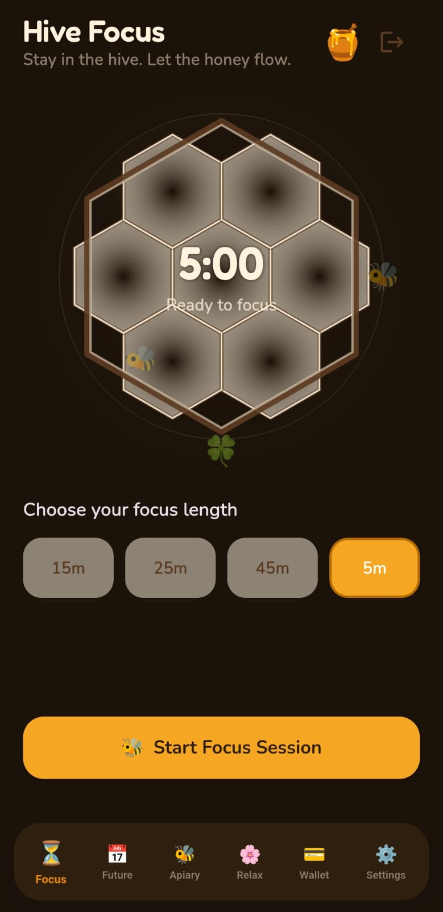
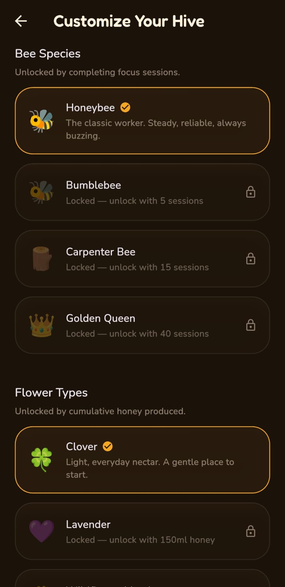

# 🐝 HiveFocus — Gamified Productivity & Focus Timer

[](https://flutter.dev)
[](https://dart.dev)
[](LICENSE)
[]()

**HiveFocus** is a feature-rich, beautifully crafted gamified productivity application built with Flutter. It transforms the classic Pomodoro focus technique into an immersive beekeeping and honey-harvesting experience. Cultivate your focus sessions, watch your digital meadow bloom, fill honeycomb cells with golden liquid honey, and build unbreakable productivity habits!

---

## ✨ Key Features

*   **🍯 Immersive Liquid Honey Timer (`HiveProgressWidget` & `HoneycombPainter`)**: Watch live wave-fill liquid honey animations fill up 7 interlocking hexagonal honeycomb cells in real-time as your focus session progresses. Includes dynamic glow effects and colony health indicators.
*   **🌾 Living Meadow Ecosystem (`MeadowView` & `BeeAnimation`)**: Experience a dynamic canvas-painted ecosystem featuring multi-layered rolling hills, procedural sun glows, responsive blooming flowers, and orbital bees circling your hive with physics-based parametric motion.
*   **🏛️ 3D Apiary Vault (`Apiary3DView`)**: Inspect your completed focus sessions visualized as a depth-illusion 3D perspective grid of honey jars receding into the distance, complete with session yield tooltips and historical metadata.
*   **📅 Consistency Calendar (`FocusCalendar`)**: Track your daily productivity streaks using a customized monthly calendar view highlighting active focus days with golden honey gradients.
*   **📊 Advanced Analytics (`ProductivityChart`)**: Analyze your honey yield over custom time horizons (Daily, Weekly, Monthly) via sleek interactive line charts with area fills and touch tooltips.
*   **✨ Glassmorphism UI (`GlassContainer`)**: Modern translucent honeycomb and glass aesthetics featuring backdrop blurring, subtle glowing borders, and seamless dark/light theme adaptation.
*   **🛡️ Robust Asset Fallbacks (`RiveOrFallback`)**: Intelligent asset wrapper that gracefully degrades between binary Rive animations and native Flutter custom painters to ensure zero crash vulnerability.

---

## 📂 Project Architecture & Components

The application is modularly structured around custom UI widgets and rendering components:

```text
lib/
├── widgets/
│   ├── apiary_3d_view.dart          # 3D perspective grid of completed honey jars
│   ├── bee_animation.dart           # Orbital flight physics & blooming flower pulses
│   ├── focus_calendar.dart          # Monthly consistency tracking calendar
│   ├── glass_container.dart         # Translucent glassmorphism containers
│   ├── hive_progress_widget.dart    # Central focus timer wrapper & wave controller
│   ├── honeycomb_painter.dart       # Custom canvas painter for hexagonal honey cells
│   ├── meadow_view.dart             # Living background ecosystem & rolling hills
│   ├── productivity_chart.dart      # FL-Chart line analytics & range toggles
│   ├── profile_dashboard_card.dart  # User metadata & productivity stats card
│   └── rive_or_fallback.dart        # Rive asset loader with native fallback
```

---

## 🚀 Getting Started

### Prerequisites

Ensure you have the following installed on your local machine:
*   [Flutter SDK](https://docs.flutter.dev/get-started/install) (v3.0 or higher)
*   [Dart SDK](https://dart.dev/get-started) (v3.0 or higher)
*   An IDE such as [VS Code](https://code.visualstudio.com/) or [Android Studio](https://developer.android.com/studio)

### Installation & Setup

1. **Clone the repository:**
   ```bash
   git clone https://github.com/your-username/hive-focus.git
   cd hive-focus
   ```

2. **Install dependencies:**
   ```bash
   flutter pub get
   ```

3. **Run the application:**
   ```bash
   flutter run
   ```

---

## 📦 Dependencies

HiveFocus relies on robust, production-ready Flutter packages:

| Package | Purpose |
| :--- | :--- |
| [`fl_chart`](https://pub.dev/packages/fl_chart) | Highly customizable interactive line charts for productivity analytics. |
| [`table_calendar`](https://pub.dev/packages/table_calendar) | Feature-packed calendar widget for streak and focus day tracking. |
| [`rive`](https://pub.dev/packages/rive) | Vector graphic animations for interactive UI elements (with native fallback). |
| [`firebase_auth`](https://pub.dev/packages/firebase_auth) | User authentication and session management. |

---

## 📱 Screenshots & Visuals

<p align="center">
  
  
  
  
  
  
  
  
</p>


